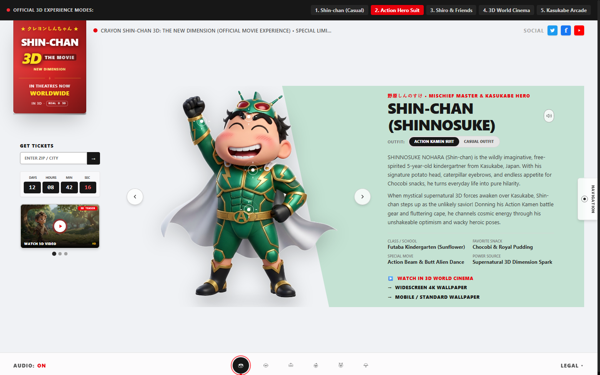
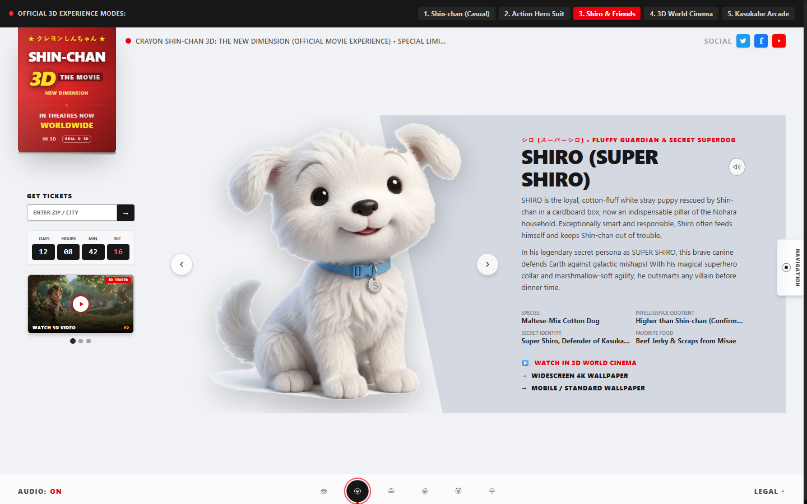
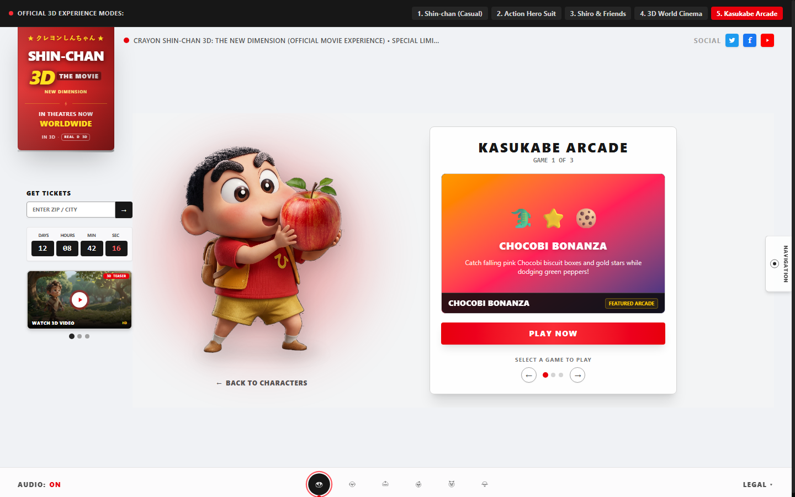
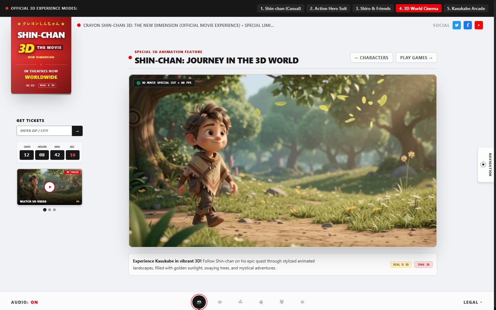
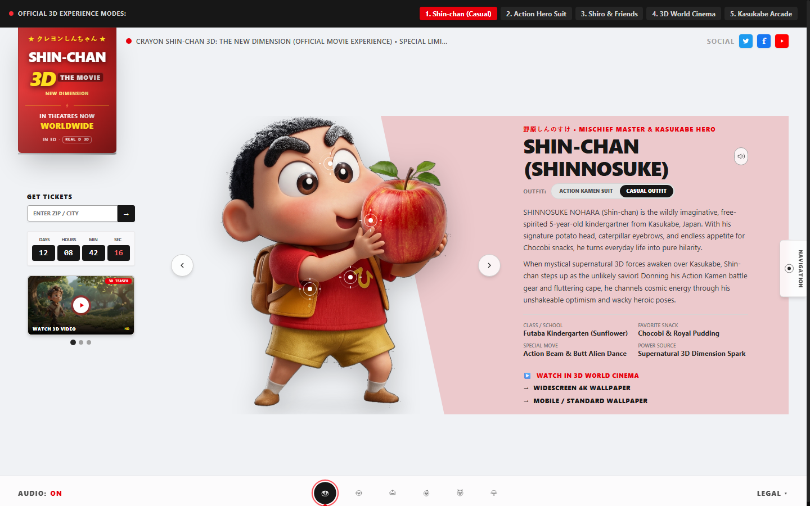

# Crayon Shin-chan 3D The Movie // Official Web Experience
### 野原しんのすけ 3D 超次元体験 — Kasukabe Defense Force Theatrical Portal

<div align="center">

[](https://react.dev/)
[](https://www.typescriptlang.org/)
[](https://vitejs.dev/)
[](https://tailwindcss.com/)
[](https://motion.dev/)
[](LICENSE)

**An ultra-modern, cinematic, interactive promotional web experience inspired by the 3D animated theatrical world of Crayon Shin-chan.**

[Features](#-key-features) • [Preview Gallery](#-visual-gallery) • [Tech Stack](#-technology-stack) • [Architecture](docs/ARCHITECTURE.md) • [Project Structure](#-project-structure) • [Local Development](#-getting-started-locally) • [Free Deployment Guide](#-free-deployment-guide)

</div>

---

## 🌟 Overview

The **Crayon Shin-chan 3D Official Experience** is a high-performance, responsive single-page web application engineered to celebrate the theatrical release of *Crayon Shin-chan 3D The Movie*. 

Built with **React 19**, **Vite**, **TypeScript**, and **Tailwind CSS v4**, the application delivers a studio-grade interactive experience featuring smooth typography, dynamic micro-interactions, an in-browser Web Audio synthesizer, full character showcases with interactive holographic reticles, playable arcade mini-games, and a living 3D cinema stage.

---

## ✨ Key Features

### 🦸 1. Theatrical Character Showcase & Holographic Reticles
- **6 Full-Fledged Character Profiles**: Detailed profiles, Japanese voice line quotes, personality specs, and traits for **Shin-chan**, **Shiro**, **Action Kamen**, **Himawari**, **Buriburizaemon**, and **Toru Kazama**.
- **Hero & Civilian Mode Switcher**: Instantly toggle between Shin-chan's standard kindergarten attire and his cosmic superhero outfit.
- **Interactive Holographic Reticle Points**: Clickable inspection nodes positioned across character models reveal lore tidbits, costume schematics, and comedic commentary.

### 🕹️ 2. Kasukabe Arcade (Playable Mini-Games)
- **Butt-Alien Telekinesis**: Tap to charge psychic energy and bounce incoming cosmic rocks to score combos.
- **Chocobi Crunch Catch**: Catch falling boxes of Shin-chan's favorite snack before time runs out.
- **Action Beam Showdown**: Rapid-tap beam clashing battle against invaders with dynamic power bars.
- **Zero-Dependency Web Audio Synth**: Custom synthesized sound effects (chimes, clicks, power blasts, giggles) powered entirely by the native HTML5 Web Audio API.

### 🎬 3. Living 3D Cinema & Video Stage
- Seamless looping 3D character walk animation showcasing stylized CGI physics.
- Theatrical multi-trailer carousel modal with official video playback and HD poster previews.
- Fullscreen cinema mode and immersive dark backdrop styling.

### 🎟️ 4. Box Office & Fan Downloads
- **Interactive Ticket Finder**: Search nearby theaters by ZIP / postal code with live seat availability simulation and calendar showtime selectors.
- **Wallpaper Download Center**: High-resolution wallpaper generator supporting both 16:9 widescreen desktop and 9:16 mobile formats.
- **Studio Navigation Drawer & Slide Spy**: Fixed HUD floating character dock with audio toggles, slide mode jump shortcuts, and legal disclaimers.

---

## 📸 Visual Gallery

| Character Showcase (Hero Mode) | Interactive Reticle Inspection |
| :---: | :---: |
|  |  |

| Kasukabe Arcade Mini-Games | Living 3D Cinema Video Showcase |
| :---: | :---: |
|  |  |

<div align="center">

### Complete Landing Page Experience


</div>

---

## 🛠️ Technology Stack

| Layer | Technologies |
| :--- | :--- |
| **Framework** | [React 19](https://react.dev/) + [React DOM 19](https://react.dev/) |
| **Build Tooling** | [Vite 8](https://vitejs.dev/) (Lightning-fast HMR and optimized Rollup bundling) |
| **Language** | [TypeScript 5.7+](https://www.typescriptlang.org/) (Strict type checking) |
| **Styling** | [Tailwind CSS v4](https://tailwindcss.com/) with `@tailwindcss/vite` |
| **Animations** | [Motion (Framer Motion v12)](https://motion.dev/) & Hardware-accelerated CSS transitions |
| **Icons** | [Lucide React](https://lucide.dev/) |
| **Audio** | Native Web Audio API Sound Synthesizer (zero external MP3 bandwidth needed) |

---

## 📁 Project Structure

```text
disney-big-hero-6-official-experience/
├── public/
│   ├── images/
│   │   ├── characters/          # High-resolution character cutouts (Shin-chan, Shiro, etc.)
│   │   └── ui/                  # UI posters and promotional banners
│   └── videos/
│       └── shinchan_3d_walk.mp4 # 3D looping character walking sequence
├── docs/
│   └── screenshots/             # Showcase preview images used in documentation
├── src/
│   ├── components/
│   │   ├── art/
│   │   │   └── ShinchanCharacterArt.tsx  # Dynamic character image renderer
│   │   ├── modals/
│   │   │   ├── LegalModal.tsx            # Copyright & licensing information
│   │   │   ├── TicketModal.tsx           # Box office ticket search simulation
│   │   │   ├── TrailerModal.tsx          # Video player with multi-trailer carousel
│   │   │   └── WallpaperModal.tsx        # High-res poster & wallpaper downloads
│   │   ├── CharacterSection.tsx          # Full-height character showcase section
│   │   ├── CharacterSelectorBar.tsx      # Floating bottom dock with sound & modal triggers
│   │   ├── GamesSection.tsx              # Kasukabe Arcade interactive mini-games
│   │   ├── Header.tsx                    # Studio header with movie banner & ticker
│   │   ├── LivingCinemaSection.tsx       # Embedded continuous 3D video display
│   │   ├── MovieBanner.tsx               # Animated movie marquee banner
│   │   ├── NavigationDrawer.tsx          # Right-side overlay quick-navigation menu
│   │   └── ReticleTarget.tsx             # Interactive pulsing inspection points
│   ├── data/
│   │   └── characters.ts                 # Character stats, quotes, lore, reticle coordinates
│   ├── utils/
│   │   └── audio.ts                      # Web Audio API sound FX generator
│   ├── App.tsx                           # Master orchestrator component
│   ├── index.css                         # Tailwind CSS v4 styling & custom typography
│   └── main.tsx                          # React 19 application mount
├── .env.example                          # Environment variables template
├── .gitignore                            # Comprehensive production ignore patterns
├── index.html                            # Semantic HTML5 entry with Google Fonts & OpenGraph
├── package.json                          # Dependencies and npm scripts
├── tsconfig.json                         # TypeScript compiler configuration
└── vite.config.ts                        # Vite configuration with Tailwind CSS plugin
```

---

## 🚀 Getting Started Locally

### Prerequisites
- **Node.js**: `v18.0.0` or higher (`v20.x` or `v22.x` recommended)
- **Package Manager**: `npm`, `pnpm`, or `yarn`

### Installation & Run

1. **Clone or Navigate to the Repository**:
   ```bash
   git clone https://github.com/<your-username>/<your-repo-name>.git
   cd <your-repo-name>
   ```

2. **Install Dependencies**:
   ```bash
   npm install
   ```

3. **Start the Development Server**:
   ```bash
   npm run dev
   ```
   Open your browser at `http://localhost:5173` (or the URL displayed in your terminal).

4. **Type Check**:
   ```bash
   npm run lint
   ```

5. **Production Build**:
   ```bash
   npm run build
   ```
   Compiled, minified, production-ready static assets will be output to the `dist/` directory.

6. **Preview Production Build**:
   ```bash
   npm run preview
   ```

---

## 🌐 Free Deployment Guide

This project is a **100% client-side static Single Page Application (SPA)** with zero backend or database requirements. You can host it completely **free forever** on any modern cloud hosting platform.

Below are step-by-step instructions for the top free hosting providers:

### Option 1: Vercel (⭐ Strongly Recommended)
*Best for speed, zero configuration, automatic HTTPS, and global edge network.*

1. Push your code to a [GitHub](https://github.com/) repository:
   ```bash
   git init
   git add .
   git commit -m "Initial commit: Crayon Shin-chan 3D Web Experience"
   git branch -M main
   git remote add origin https://github.com/<your-username>/<your-repo-name>.git
   git push -u origin main
   ```
2. Go to [vercel.com](https://vercel.com/) and sign in with GitHub.
3. Click **"Add New..."** → **"Project"**.
4. Select your repository from the list.
5. Vercel automatically detects **Vite**:
   - **Framework Preset**: `Vite`
   - **Build Command**: `npm run build`
   - **Output Directory**: `dist`
   - **Install Command**: `npm install`
6. Click **Deploy**. Your site will be live on an official `*.vercel.app` URL with automated continuous deployment on every `git push`.

---

### Option 2: Render (Free Static Site)
*Ideal if you want simple, reliable hosting on Render's free tier.*

1. Push your repository to GitHub.
2. Visit [render.com](https://render.com/) and log in.
3. Click **"New +"** in the top navigation bar and select **"Static Site"**.
4. Connect your GitHub account and choose this repository.
5. Configure the build parameters:
   - **Name**: `shinchan-3d-experience` (or your choice)
   - **Branch**: `main`
   - **Build Command**: `npm run build`
   - **Publish Directory**: `dist`
6. Click **"Create Static Site"**. Render will install dependencies, execute Vite build, and provide a free `*.onrender.com` SSL domain.

---

### Option 3: Netlify (Free Tier)
*Great for instant drag-and-drop or GitHub branch deployment.*

**Via GitHub Integration**:
1. Log in to [netlify.com](https://netlify.com/) and click **"Add new site"** → **"Import an existing project"**.
2. Select **GitHub** and pick this repository.
3. Build settings:
   - **Build command**: `npm run build`
   - **Publish directory**: `dist`
4. Click **"Deploy site"**. Your project will be published instantly with a free `*.netlify.app` domain.

**Via Instant Manual Upload (No Git required)**:
1. Run `npm run build` on your computer.
2. Drag and drop the generated `dist` folder into the Netlify Dashboard upload box.

---

### Option 4: Cloudflare Pages (100% Free & Unlimited Bandwidth)
*Best for ultra-fast CDN delivery with zero bandwidth caps.*

1. Go to [dash.cloudflare.com](https://dash.cloudflare.com/) → **Compute (Workers & Pages)** → **Create application** → **Pages**.
2. Connect your GitHub repository.
3. In **Build Settings**:
   - **Framework Preset**: `Vite`
   - **Build command**: `npm run build`
   - **Build output directory**: `dist`
4. Click **"Save and Deploy"**.

---

### Option 5: GitHub Pages (Directly from GitHub)
*Deploy directly from your repository using GitHub Actions.*

1. In your GitHub repository, go to **Settings** → **Pages**.
2. Under **Build and deployment** → **Source**, select **GitHub Actions**.
3. Create a workflow file at `.github/workflows/deploy.yml`:
   ```yaml
   name: Deploy to GitHub Pages

   on:
     push:
       branches: ['main']
     workflow_dispatch:

   permissions:
     contents: read
     pages: write
     id-token: write

   concurrency:
     group: 'pages'
     cancel-in-progress: true

   jobs:
     deploy:
       environment:
         name: github-pages
         url: ${{ steps.deployment.outputs.page_url }}
       runs-on: ubuntu-latest
       steps:
         - name: Checkout
           uses: actions/checkout@v4
         - name: Set up Node
           uses: actions/setup-node@v4
           with:
             node-version: 20
             cache: 'npm'
         - name: Install dependencies
           run: npm install
         - name: Build
           run: npm run build
         - name: Setup Pages
           uses: actions/configure-pages@v4
         - name: Upload artifact
           uses: actions/upload-pages-artifact@v3
           with:
             path: './dist'
         - name: Deploy to GitHub Pages
           id: deployment
           uses: actions/deploy-pages@v4
   ```
4. Push to `main`. Your site will deploy to `https://<username>.github.io/<repo-name>/`.
*(Note: If deploying to a GitHub Pages subfolder, specify `base: './'` in `vite.config.ts`)*.

---

## ⚡ Deployment Readiness Checklist

- [x] **Production Build Tested**: `npm run build` builds cleanly in < 300ms without errors.
- [x] **TypeScript Validation**: `tsc --noEmit` checks with 0 type errors.
- [x] **Zero Unused Assets**: Removed redundant video duplicates (~7.1MB) and raw images (~7MB).
- [x] **Clean Architecture**: Legacy unused Big Hero 6 SVG templates and superseded components removed.
- [x] **Optimized Dependencies**: Removed unused server and AI packages (`express`, `@google/genai`, `dotenv`, `tsx`).
- [x] **Production `.gitignore`**: All sensitive files, logs, caches, and build folders excluded.
- [x] **Modern SEO & OpenGraph**: Configured in `index.html` with Japanese typography and social sharing metadata.

---

## 📄 License & Credits

This project was built for educational and portfolio demonstration purposes as an homage to the official *Crayon Shin-chan* franchise created by Yoshito Usui / Futabasha, Shin-Ei Animation, TV Asahi, and ADK.

Released under the [MIT License](LICENSE).
