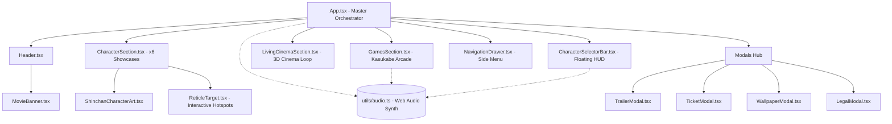

# Architecture & Technical Design Specification
### Crayon Shin-chan 3D The Movie // Official Web Experience

---

## 🏛️ 1. Architecture Overview

The application is structured as a reactive, component-driven Single Page Application (SPA) built with **React 19**, **Vite 8**, and **Tailwind CSS v4**. It follows a top-down state coordination model where the root component ([src/App.tsx](file:///c:/Users/Shind/Downloads/disney-big-hero-6-official-experience/src/App.tsx)) orchestrates global slide tracking, scroll-spy coordinates, audio feedback toggles, and modal states.

---

## 🎨 2. Design System & Aesthetics

### Visual Philosophy
The website's visual aesthetic fuses Japanese **Tokusatsu** superhero conventions with modern **Manga Pop Art** and sleek contemporary web design (glassmorphic cards, dynamic glowing reticles, micro-interactions).

### Character Palette Tokens

| Character | Accent Hex | Role / Archetype | Color Identity |
| :--- | :--- | :--- | :--- |
| **Shin-chan** | `#16a34a` (Hero) / `#dc2626` (Casual) | Kasukabe Defense Leader | Action Green & Crimson Red |
| **Shiro** | `#0284c7` / `#ffffff` | Kasukabe White Wonder | Cyan & Pure Cotton White |
| **Action Kamen** | `#059669` / `#eab308` | Righteous TV Icon | Emerald Green & Tokusatsu Gold |
| **Himawari** | `#ea580c` / `#fbbf24` | Sparkling Treasure Hunter | Amber & Sunburst Yellow |
| **Buriburizaemon** | `#7c3aed` / `#ec4899` | Hero for Hire (Coward) | Royal Violet & Piglet Pink |
| **Toru Kazama** | `#2563eb` / `#0284c7` | Elite Kasukabe Prodigy | Academic Cobalt & Sapphire Blue |

### Typography Scale
- **Display Headlines**: `Bebas Neue` & `Syne` — High-impact, cinematic uppercase titling.
- **Japanese Titles & Subheads**: `Noto Sans JP` (weights 700 & 900) — Authentic theatrical branding.
- **Body & Specs**: `Plus Jakarta Sans` & `Montserrat` — Legible, geometric, modern grotesque styling.

---

## 🔊 3. Procedural Web Audio Engine

Rather than relying on bandwidth-heavy static `.mp3` files that induce latency, the audio subsystem ([src/utils/audio.ts](file:///c:/Users/Shind/Downloads/disney-big-hero-6-official-experience/src/utils/audio.ts)) uses the native **HTML5 Web Audio API** to generate procedural sound effects on the fly:

- **Oscillator Types**: Sine, Triangle, Square, and Sawtooth waveforms with exponential gain decay.
- **Synthesized Effects**:
  - `playBlip(freq)`: Soft UI button clicks & hover feedback.
  - `playTone(freq, duration)`: Modal opening and menu state shifts.
  - `playShinchanGiggle()`: Rapid frequency-modulated pitch sweep mimicking Shin-chan's laugh.
  - `playActionBeam()`: Pitch-dropping pulse wave simulating Action Kamen's laser burst.
  - `playChocobiCrunch()`: Frequency noise simulation for arcade snack pickup.

---

## 🎯 4. Interactive Reticle System

Each character showcase renders normalized holographic inspection nodes ([src/components/ReticleTarget.tsx](file:///c:/Users/Shind/Downloads/disney-big-hero-6-official-experience/src/components/ReticleTarget.tsx)):
- **Coordinate System**: Percentage-based `(x: 0-100, y: 0-100)` relative to the character container.
- **Stateful Tooltip Expansion**: Hovering or clicking an inspection target expands a high-contrast HUD callout detailing costume lore, comedic stats, and weapon specs.
- **Responsive Positioning**: Adapts dynamically across mobile touch targets and desktop mouse cursors.

---

## 🕹️ 5. Kasukabe Arcade Architecture

The mini-games section ([src/components/GamesSection.tsx](file:///c:/Users/Shind/Downloads/disney-big-hero-6-official-experience/src/components/GamesSection.tsx)) features three self-contained game loops:

1. **Butt-Alien Telekinesis**:
   - `requestAnimationFrame` state updates.
   - Dynamic bounce physics and combo multiplier tracking.
2. **Chocobi Crunch Catch**:
   - Timed drop loop with lane positioning and keyboard / touch-friendly catcher paddle.
3. **Action Beam Showdown**:
   - Rapid-action button mash meter clashing against AI opponent beam resistance.

All mini-games maintain local high scores and provide instant replayability without reloading the page.

---

## ⚡ 6. Performance & Optimization

1. **Asset Footprint**:
   - Image cutouts are pre-compressed transparent WebP/PNGs.
   - 3D walking video is encoded with H.264 high profile for instant buffering on mobile and desktop.
2. **Bundle Optimization**:
   - Production Vite bundle compiles to **< 420 kB** JS and **< 65 kB** CSS (gzipped).
   - Zero dead code: Unused dependencies and Big Hero 6 starter files have been eradicated.
3. **Scroll-Spy & Smooth Navigation**:
   - Passive scroll listeners prevent main-thread jank.
   - Character selector bar calculates section offsets with viewport buffering.
